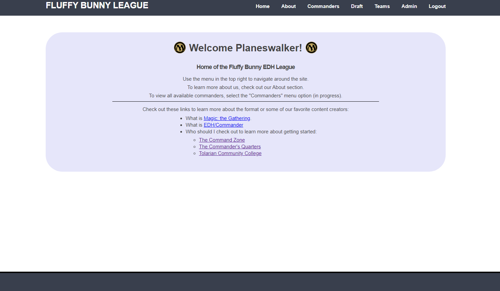
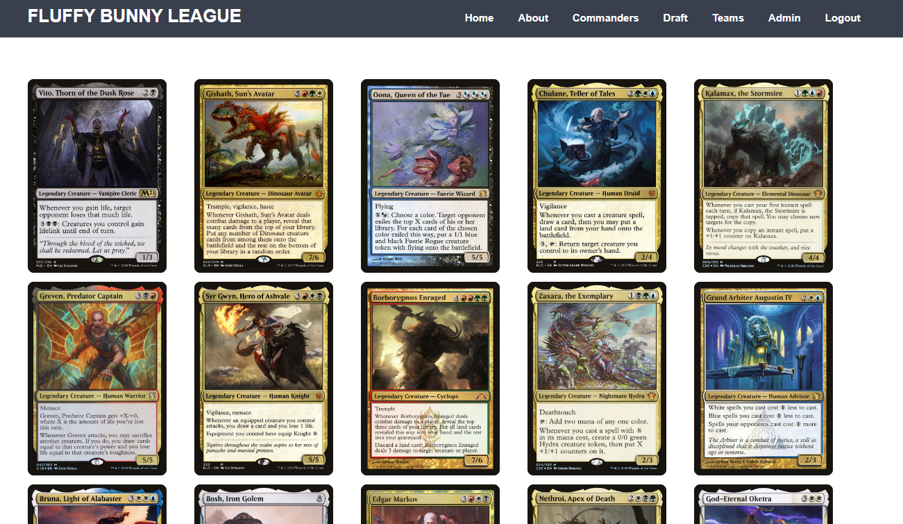
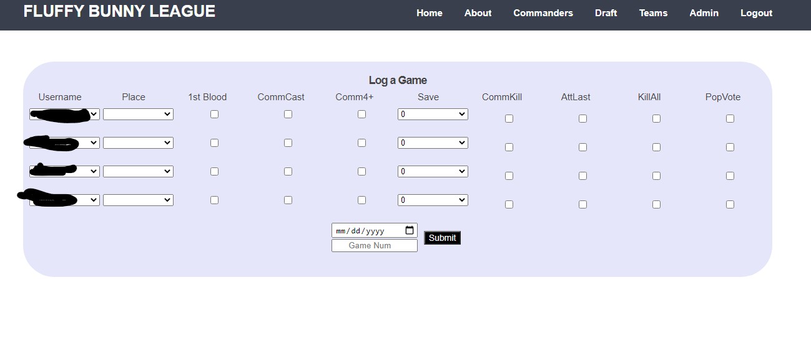
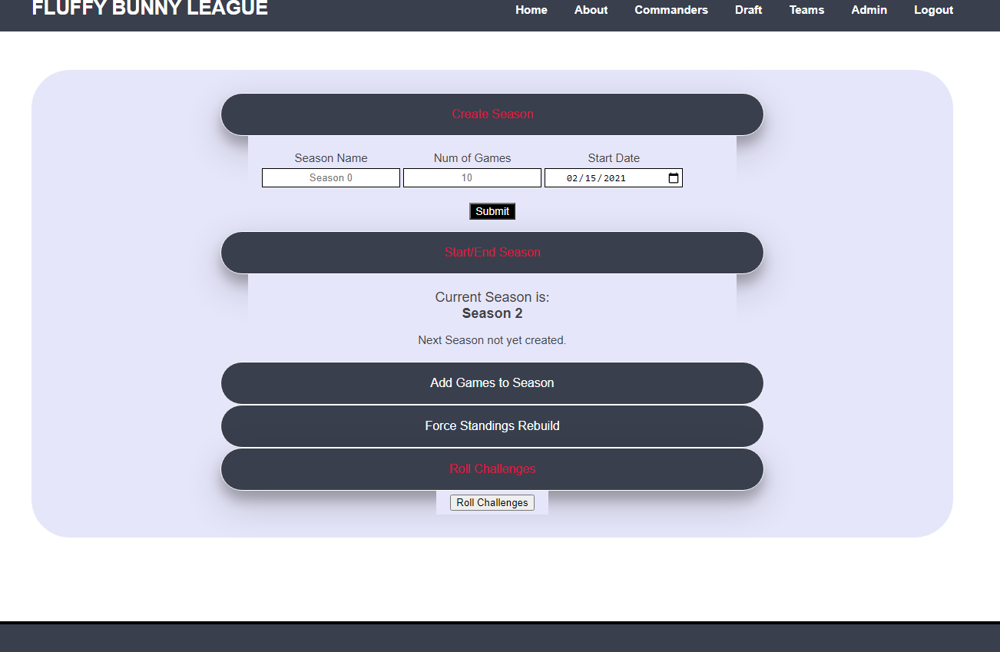

# MTG League Flask App 
## About
Python/Flask/PostgreSQL/JavaScript/CSS/HTML

[The Site](https://fluffybunnyleague.herokuapp.com/) - This is hosted as a free tier site on [Heroku](https://heroku.com), so it might take 30-60 seconds to spin up as Heroku puts the site to sleep if there has not been any recent activity.

This began as a small project to facilitate a random secret draft from a small pool for a Magic the Gathering Commander league and to help me learn Flask. It evolved to handle functionality that we had previously been tracking in Google Drive docs and sheets. The site is an ever evolving web app as we change seasons and change the structure of the league. 

## Current and Future Work
My current project for this site is a UI redesign and my next major project will be restructuring the game logging and deck logging portions of the site for Season 3. 

### The UI Project
I built the original UI from the ground up as I was still learning CSS stylings and some early onsite JavaScript functionality. While I am proud of what I created, it definitely does not have a modern feel and could stand to be improved. Thus I began to improve the UI with the help of [Templated.co](https://templated.co/).

Templated gave me a jump start on core functionality and a new look, but I am working on making each page something that truly feels like I built it. 

The site functionality currently still lives in the old UI, but a glance at the future can be seen in the below screenshot and fully explored by navigating to [this page](https://fluffybunnyleague.herokuapp.com/new_ui)

## What Does it Do

With a lot of the functionality locked behind a login, it is hard to truly show off the capability of the site, so below is an explanation of each page and how they work.

### Home

The Navbar contains multiple dropdown selections under most headers. Nothing else special here, just a basic landing page that provides some introductory info and some links to learn more about the game and format.

### About

This page is the first dynamic page, running a query against a reporting table in the PostgreSQL database via Flask to return the current standings. This page also has some basic hover animation over the scoreboard.

### Rules

This is essentially just a giant HTML page listing the official rules of the site, no screenshot included since it is just a wall of text.

### Commanders

This page uses Javascript to loop through a Python dict provided by the flask endpoint via a PostgreSQL query and return all the Commanders that are available to draft in the current season.

### Draft

This is a simple form to input username and output a randomly chosen Commander for when we do random drafts. The form posts to the Flask endpoint, which triggers a random selection of the available Commanders from the PostgreSQL query, then stores and returns the drafted commander so that if a user hits the form a second time, it will return the already drafted commander. 

### Teams

This page is similar to the Commanders page, except that it returns the drafted teams from the greater list of Commanders. Each user has a block that displays their drafted commanders.

### Admin - Log a Game

This is our scoring logger for use during each game. The form returns a giant array that is parsed by the Flask endpoint and stored in a database table. The raw scores are converted to JSON dicts and stored in a JSON field, while some calculated fields are stored in their own columns to make reporting easier.

### Admin - Season Admin

This panel handles several admin functions related to starting/ending seasons, adding games, or rolling random challenges. Each panel has an onclick toggle to display or hide, and the roll challenges panel actually has a special toggle to stay open when a challenge is rolled. 

The functions to start/end seasons and add games are simple forms that generate insert queries into DB tables. There is on conflict handling, in case someone tries to insert duplicates, and the raw data is securely parsed with args formatting to protect against SQL injection.

The standings rebuild forces a re-run of the update to the reporting table that holds the most up to date scores for each player. The rebuild is handled programmatically any time a game is logged or scores are updated, however, I have found the need to add this in cases where someone incorrectly scores a game and I need to manually update the database to resolve the issue.

